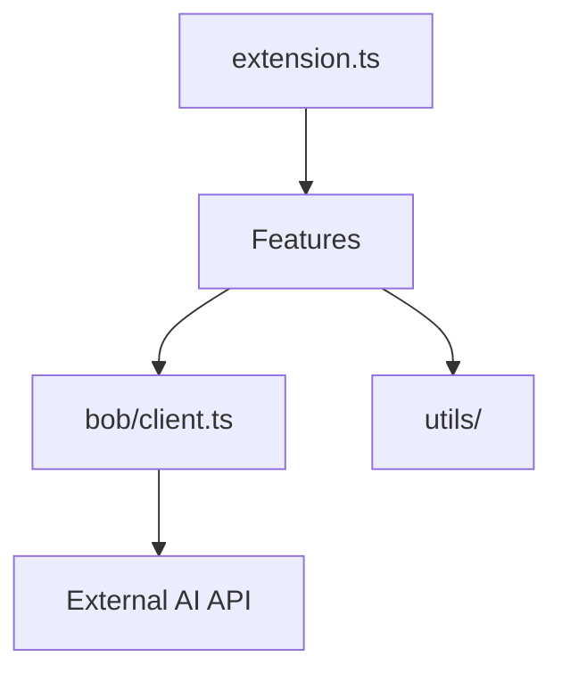

# 🔍 Repository X-Ray: Onboard Extension

> **Comprehensive Onboarding Documentation**
> 
> Generated on: 5/2/2026, 10:00:00 AM  
> Analysis Version: 1.0.0

This document provides a complete overview of the codebase architecture, conventions, and key insights to help you get up to speed quickly.

---

## 📋 Table of Contents

1. [Entry Points](#-entry-points)
2. [Architecture Overview](#-architecture-overview)
3. [Critical Path](#-critical-path)
4. [Coding Conventions](#-coding-conventions)
5. [Technical Stack](#-technical-stack)
6. [Weird Parts](#-weird-parts)

---

## 🚪 Entry Points

The extension is structured around VS Code's contribution points, with specific features isolated in the `features/` directory.

### Key Entry Points

#### 🔴 Critical Priority

**`onboard-extension/src/extension.ts`**
- **Role:** Extension Main
- **Description:** The primary entry point where VS Code activates the extension and registers all commands and providers.

#### 🟠 High Priority

**`onboard-extension/src/bob/client.ts`**
- **Role:** API Client
- **Description:** Centralized client for communicating with the Bob/Watsonx AI services.

---

## 🏗️ Architecture Overview

### Architecture Diagram

### Dependency Flow

VS Code -> Features -> Bob Client -> External API

### Architectural Layers

#### Integration Layer

VS Code specific code including extension activation and command registration.

**Key Files:**
- `src/extension.ts`

**Dependencies:** Feature Layer, Client Layer

#### Feature Layer

Business logic for specific onboarding tools like Repo X-Ray and Day-N Plan.

**Key Files:**
- `src/features/`

**Dependencies:** Client Layer, Utility Layer

#### Client Layer

Abstraction for AI model communication.

**Key Files:**
- `src/bob/`

**Dependencies:** Utility Layer

### Key Architectural Patterns

- **Command Pattern**
- **Provider Pattern**
- **Schema-first (Zod) Validation**

---

## 🛤️ Critical Path

When a command like 'X-Ray Repository' is triggered, the extension gathers workspace context (file tree, key files), passes it to the Bob Client which constructs a prompt, validates the JSON response using Zod, and finally renders a Markdown report.

---

## 📐 Coding Conventions

Follow these conventions to maintain consistency with the existing codebase.

### Validation

| Rule | Examples |
|------|----------|
| Use Zod schemas for all AI responses. | `src/features/repo-xray/schema.ts` |

### UI

| Rule | Examples |
|------|----------|
| Use withProgress for any operation exceeding 1 second. | `src/features/starter-tasks/command.ts` |

---

## 🛠️ Technical Stack

Key technologies, frameworks, and libraries used in this project:

- **TypeScript**
- **VS Code Extension API**
- **Zod**
- **Winston**
- **Dotenv**

---

## ⚠️ Weird Parts

A few utility scripts and manual implementations deviate from standard practices.

The following parts of the codebase deviate from established conventions or patterns:

### 🟢 Low Severity

> **📍 `onboard-extension/update_git.js`**
>
> **What's weird:** Utility scripts located in the root of the extension folder rather than a scripts/ directory.
>
> **Why it might exist:** Likely temporary or demo-specific automation for repo state management.

---

## 📚 Next Steps

Now that you understand the codebase structure:

1. **Explore Entry Points**: Start by examining the critical entry points listed above
2. **Follow the Critical Path**: Trace through a typical request flow to understand the system
3. **Review Conventions**: Familiarize yourself with the coding standards before making changes
4. **Investigate Weird Parts**: Understand the context behind unusual code patterns
5. **Set Up Your Environment**: Refer to the README.md for setup instructions

---

*This document was automatically generated by Onboard X-Ray. For questions or issues, please refer to the project documentation.*